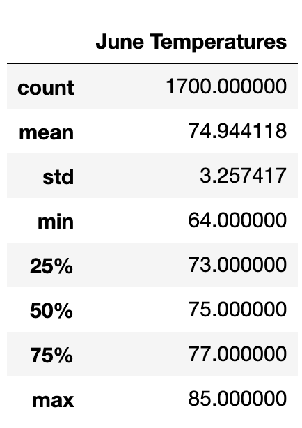
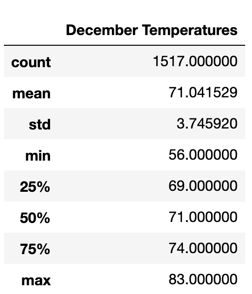

# Surfs Up Weather Analysis

The purpose of this project is to analyze temperature data to determine if it is feasible for a surf and ice cream shop to stay open all year. This analysis contains descriptive statistics of the temperatures from June and December from the given data.

# Results 

* The average temperature in June is about 74 while the average temperature in December is about 71. 

* The Highest temperature recoded for June in this data set is about 85 while the highest temperature recorded in the data set for December is 83. 

* The difference in temperature is not significant and would likely have little effect on year-round sales. 

# Summary 

According to the temperature results, it is feasible for a surf and ice cream shop to stay open year-round. Before making a final decision, I would recommend running additional queries. One including the temperature and precipitation to find the number of warm days with minimal rainfall.  Another with date and rainfall to see which times of year may have slower business due to rain. 

 
